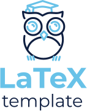

# **:triangular_flag_on_post: REST API DOCUMENTATION LATEX TEMPLATE**

> A LaTeX template for Rest API documentation

---

## **:package: Main tools used**

- [x] LaTeX

---

## **:wrench: Developer usage**

### **Set up project**

Before cloning the repo **be sure** you have installed:

- [**LATEX**](https://www.latex-project.org/)

Or you can use:
- [**OVERLEAF**](https://www.overleaf.com)

Then:

- Choose a folder project in your system and switch in `cd [folder path]`
- Clone the repo in your folder path `git clone https://github.com/christianascone/Rest-API-Documentation-Latex-Template.git`

---

### **Usage**

Copy `main.tex`  and edit it with preferred tool.

---

## **:handshake: Contributing**

- Fork it!
- Create your feature branch: `git checkout -b feature/my-new-feature`
- Commit your changes: `git commit -am 'Add some feature'`
- Push to the branch: `git push origin feature/my-new-feature`
- Submit a pull request

---

### **:busts_in_silhouette: Credits**

- [Jean-Philippe Eisenbarth](https://github.com/jpeisenbarth) (For his template: [SRS-IEEE](https://github.com/jpeisenbarth/SRS-Tex))
- [Free Logo Design](https://freelogodesign.org) (For logo)

---

### **:heart: Show your support**

Please :star: this repository if you like it or this project helped you!\
Feel free to open issues or submit pull-requests to help me improving my work.

---

### **:scroll: Release history**

* 0.1.0
    * First version

---

### **:robot: Author**

_*Christian Ascone*_

> You can follow me on
[GitHub](https://github.com/christianascone)&nbsp;&middot;&nbsp;[GitLab](https://gitlab.com/christianascone)

---

Copyright © 2019 [Christian Ascone](https://github.com/christianascone).\
License [GPL-3.0](https://github.com/christianascone/Rest-API-Documentation-Latex-Template/blob/master/LICENSE).